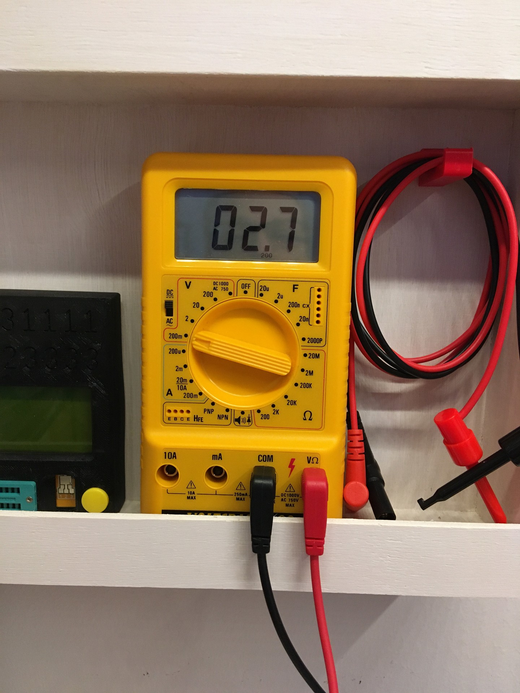
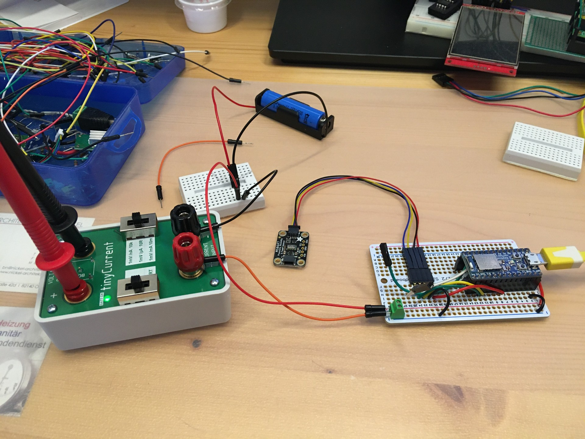

# ble_sensor_adv
BLE advertising sensor node. Using a modified Adafruit ItsyBitsy nRF52840 with MS8607 sensor and 2.7µA deep sleep current

## Modifications to the ItsyBitsy nRF52840
* Dotstar LED removed
* LDO regulator removed
* Sensor MS8607 is powered via GPIO pin

## Software Optimizations
* Sensor data is transmitted as BLE advertising broadcast
* no permanent connection to central with notify any more
* delay() **before** measurement und BLE activation uses **2,7 µA** (!)
* Soft reset (`NVIC_SystemReset();`) after measurement and advertising. Otherwise the Nordic Softmodem stays active and consumes 274 µA!

 

